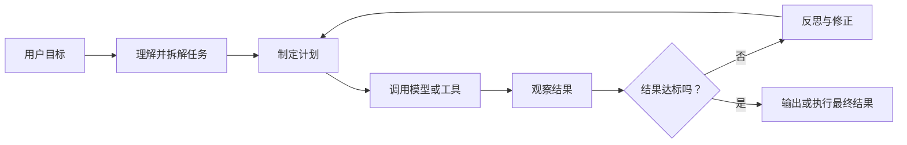
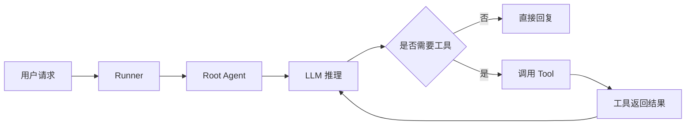

## 一句话理解 Agentic AI

普通大模型是：

> 你问一句，它答一句。

Agentic AI 是：

> 你给它一个目标，它自己拆任务、选工具、执行、检查结果，必要时重新修改，最后交付结果。

例如：

你说：

> “帮我写一篇关于黑洞的研究报告。”

普通大模型可能直接生成文章。

Agentic AI 会这样做：

1. 先生成文章大纲；
2. 判断是否需要查资料；
3. 调用搜索工具；
4. 筛选可靠来源；
5. 写初稿；
6. 检查事实和逻辑；
7. 修改文章；
8. 输出最终报告。

所以，Agentic AI 的核心不是“模型更会聊天”，而是：

> 把模型放进一个可以执行多步任务的工作流里。                     


## 一、普通工作流和智能体工作流

### 1. 普通工作流

```
用户问题 → LLM → 最终答案
```

这叫直接生成、零样本生成，优点是快，缺点是：

- 没有中间检查；
- 出错后不会自动修正；
- 复杂任务容易遗漏；
- 不能主动访问外部信息。

### 2. Agentic 工作流



它更像一个人做事情：

> 先想清楚要做什么，再分步骤做，做完检查，发现问题就返工。


## 二、“自主性”到底是什么意思？

Agent 并不是非黑即白的概念，而是有不同程度的自主性。

### 低自主性

工程师把流程全部写死：

```
先搜索
再读取网页
再总结
再发送邮件
```

模型主要负责写文字，什么时候做什么由程序决定。

### 高自主性

只告诉模型目标：

> “帮客户找到低于 100 美元且有库存的圆形太阳镜。”

模型自己决定：

1. 调商品描述工具；
2. 查库存；
3. 查价格；
4. 过滤结果；
5. 回复客户。

自主性越高，系统越灵活，但也越难控制、测试和调试。

因此实际工程里不是“越自主越好”，而是：

> 在可控范围内，给模型足够的决策权。


## 三、Agent 的基本组成

一个 Agent 系统通常由四部分组成：

### 1. 模型

负责：

- 理解用户意图；
- 生成文本；
- 拆分任务；
- 决定调用什么工具；
- 根据结果继续推理。

### 2. 工具

工具就是模型可以调用的函数，例如：

```
get_current_time()
search_web(query)
query_database(sql)
send_email(to, content)
check_inventory(item_id)
```

模型本身不能直接查数据库、发邮件、看实时天气。

它只能提出请求：

> “请调用 `get_current_time()`。”

真正执行函数的是外部程序。

### 3. 外部数据

例如：

- 数据库；
- 网页；
- 文件；
- 日历；
- 企业内部系统；
- API。

### 4. 编排逻辑

编排逻辑负责控制整个循环：

```
模型决定调用工具
→ 程序执行工具
→ 工具返回结果
→ 结果放回上下文
→ 模型继续判断
```


## 四、工具调用是怎么回事？

以“现在几点”为例：

```
用户：现在几点？

模型：我需要实时信息，调用 get_current_time()

程序：执行 get_current_time()
程序：返回 15:20:45

模型：现在是下午 3 点 20 分。
```

注意一个非常重要的技术事实：

> 通常不是 LLM 直接执行工具，而是 LLM 请求工具，应用程序替它执行。

工具要告诉模型三件事：

- 工具叫什么；
- 它能做什么；
- 需要哪些参数。

例如：

```
def get_current_time(timezone: str):
    """返回指定时区的当前时间"""
```

系统会把它转换成模型能理解的结构：

```
{
  "name": "get_current_time",
  "description": "返回指定时区的当前时间",
  "parameters": {
    "timezone": {
      "type": "string"
    }
  }
}
```

模型看到这个说明后，才能知道什么时候调用、参数怎么填。


## 五、反思模式：让模型检查自己的结果

反思就是：

```
先生成初稿
→ 检查初稿
→ 找出问题
→ 生成改进版
```

比如写邮件：

```
第一版：
“下个月找时间见面。”

反思：
“下个月”太模糊，没有具体日期。

第二版：
“我们可以在 5 月 5 日到 7 日之间见面吗？”
```

反思提示词不能只写：

> “请改进它。”

更好的是明确检查标准：

> “请检查这封邮件是否具体、礼貌、无拼写错误，并补充缺失的署名。”


### 反思和普通迭代的区别

普通迭代只是：

```
再生成一遍
```

反思是：

```
按照标准检查问题
→ 根据问题修改
```

所以反思不是简单重复，而是带着“批评标准”重新审查。


## 六、外部反馈比自我反思更可靠

模型自己检查自己有局限，因为它可能重复同一个错误。

更强的方式是引入外部反馈。

### 代码例子

```
模型生成代码 V1
→ 在沙盒中运行
→ 得到 SyntaxError
→ 把错误信息交给模型
→ 模型修复代码
→ 生成代码 V2
```

### 其他外部反馈

- 用正则表达式检查是否提到了竞争对手；
- 用字数统计工具检查是否超字数；
- 用搜索引擎核实事实；
- 用数据库执行结果检查 SQL；
- 用单元测试检查代码。

真正强大的闭环是：

```
生成 → 执行/检查 → 获得反馈 → 反思 → 改进
```


## 七、为什么一定要做评估？

不能只凭感觉说：

> “我觉得加了反思以后更好了。”

必须用数据比较。

例如准备 20 个问题：

```
问题：2025 年 5 月卖出了多少商品？
标准答案：1201
```

分别运行：

- 没有反思的版本；
- 有反思的版本。

然后统计准确率。

### 两种评估

#### 1. 端到端评估

看最终结果好不好。

例如：

> 最终研究报告得分多少？

#### 2. 组件级评估

单独检查某一步。

例如：

- 搜索关键词是否合理；
- 搜索结果是否权威；
- 信息提取是否准确；
- SQL 是否正确；
- 图表是否有标题和坐标轴。

这就像软件测试：

- 端到端评估 ≈ 集成测试；
- 组件级评估 ≈ 单元测试。


## 八、Agent 的工程开发流程

仓库第四模块最重要的思想是：

> 不要一开始就幻想一个完美系统，先做出能运行的版本，再根据错误改进。

完整流程是：

```
快速做出原型
→ 查看输出
→ 查看每一步的 Trace
→ 找出最常出错的组件
→ 给这个组件建立评估
→ 修改提示词、工具或模型
→ 再次测试
```

例如一个科研搜索 Agent 效果不好，可能有三种原因：

1. 搜索关键词不合理；
2. 搜索工具返回的网页质量差；
3. 模型不会筛选资料。

不能一上来就修改大模型提示词，必须先定位到底是哪一步出错。

这就是错误分析。


## 九、规划：让模型自己决定步骤

前面讲的工作流可能是工程师预先写好的：

```
固定调用 A
→ 固定调用 B
→ 固定调用 C
```

规划模式则是：

> 只给目标和工具，让模型自己生成执行计划。

例如：

```
[
  {
    "description": "查找圆形太阳镜",
    "tool": "get_item_descriptions",
    "arguments": {
      "keyword": "round sunglasses"
    }
  },
  {
    "description": "检查库存",
    "tool": "check_inventory",
    "arguments": {
      "items": "上一步返回的商品"
    }
  },
  {
    "description": "筛选低于 100 美元的商品",
    "tool": "get_item_price",
    "arguments": {
      "max_price": 100
    }
  }
]
```

结构化输出的好处是，程序可以稳定解析。

更进一步，模型可以直接写代码表达计划：

```
items = get_item_descriptions("round sunglasses")
items = check_inventory(items)
items = [x for x in items if get_item_price(x) < 100]
print(items)
```

代码表达复杂计划通常比 JSON 更灵活，但风险也更高，因此必须放在沙盒里运行。


## 十、多智能体是什么？

一个 Agent 负责所有事情，可能会变得很混乱：

```
一个模型
+ 几十个工具
+ 几千字提示词
+ 多个复杂步骤
```

多智能体的思路是把它拆成一个团队：

```
研究员 Agent
→ 报告 Agent
→ 图表 Agent
→ 审核 Agent
```

每个 Agent 只负责自己擅长的事情。

例如市场调研任务：

- 研究员：搜索资料；
- 分析员：整理数据；
- 写作者：写报告；
- 审核员：检查事实；
- 制图员：生成图表。

多智能体的优点：

- 每个角色更专注；
- 提示词更短；
- 容易复用；
- 可以并行处理；
- 有助于突破上下文长度限制。

缺点是：

- 系统更复杂；
- Agent 之间会丢信息；
- 更难追踪错误；
- 调用次数更多，成本可能更高。


## 十一、多智能体的四种通信方式

### 1. 线性模式

```
研究员 → 设计师 → 写作者
```

简单、清晰，适合固定流程。

### 2. 双层模式

```
          管理 Agent
        ↙     ↓     ↘
    研究员  设计师  写作者
```

管理 Agent 负责分配任务和汇总结果。

这是比较实用的生产模式。

### 3. 多层模式

```
总经理
├── 研究主管
│   ├── 网页研究员
│   └── 事实核查员
└── 写作主管
    ├── 内容写手
    └── 引用校对员
```

适合大型系统，但难调试。

### 4. 去中心模式

所有 Agent 可以自由交流，没有固定负责人。

灵活、富有创造性，但结果不可预测。

一般来说，初学者应优先使用：

> 线性模式或“管理 Agent + 专业 Agent”的双层模式。


## 十二、MCP 是什么？

MCP 可以理解为：

> 给 AI 接入外部工具和数据的统一插座。

以前每个应用都要单独对接：

```
应用 A → Slack
应用 A → GitHub
应用 A → Google Drive

应用 B → Slack
应用 B → GitHub
应用 B → Google Drive
```

如果有 `m` 个应用、`n` 个工具，就可能要写 `m × n` 份集成代码。

MCP 的思路是：

```
应用 → MCP Server → 外部工具
```

只需要：

- 每种工具提供一个 MCP Server；
- 每个 AI 应用连接这些 Server。

工作量从大致 `m × n` 降到 `m + n`。

MCP 的三个角色：

- Client：AI 应用，例如 Claude、Codex；
- Server：提供 GitHub、Slack、数据库等能力；
- Model：决定什么时候使用哪个能力。

Google ADK 可以作为 MCP Client。换句话说，ADK 负责组织 Agent 如何运行，MCP 负责把 Agent 接到外部工具上：

```
Google ADK Agent → MCP Client → MCP Server → GitHub / Slack / 数据库
```


## 十三、Google ADK：把 Agentic AI 工程化

前面讲的是 Agentic AI 的思想：如何拆任务、调用工具、反思、评估和协作。

Google ADK（Agent Development Kit）则是一套开发框架，帮助我们把这些思想真正写成一个可以运行、调试和部署的 Agent 应用。

可以这样区分：

```
Agentic AI：智能体应该怎样思考和做事
Google ADK：怎样把这种工作方式实现为软件
```

Google ADK 不是大模型，也不等于 Gemini。它是一个框架，负责把下面这些部分组织起来：

```
模型 + 工具 + 状态 + 工作流 + 运行器 + 调试与评估
```

官方示例通常使用 Gemini，但 ADK 也提供了对其他模型和模型集成方案的支持。


## 十四、ADK Agent 是怎样运行的？

一个 ADK Agent 的典型运行过程如下：



例如用户问：

> “纽约现在几点？”

系统会这样运行：

1. 用户消息进入 `Runner`；
2. `Runner` 把消息交给根 Agent；
3. Agent 判断这需要实时信息；
4. 模型请求调用查询时间的工具；
5. ADK 执行这个工具；
6. 工具返回时间；
7. 模型基于工具结果生成自然语言答案。

所以，ADK 的核心不是“写一个提示词”，而是持续运行这个循环：

```
理解 → 决策 → 调工具 → 得结果 → 继续推理
```


## 十五、创建第一个 ADK Agent

以下以 Python 为例。安装并创建项目：

```bash
pip install google-adk
adk create my_agent
```

项目通常包含：

```text
my_agent/
├── agent.py        # Agent 的主定义
├── .env            # API Key 等环境变量
└── __init__.py
```

其中，`agent.py` 中的 `root_agent` 是 ADK 识别的应用入口。

下面是一个带工具的最小例子：

```python
from google.adk.agents.llm_agent import Agent


def get_current_time(city: str) -> dict:
    """返回指定城市的当前时间。"""
    return {
        "status": "success",
        "city": city,
        "time": "10:30 AM",
    }


root_agent = Agent(
    model="gemini-flash-latest",
    name="time_agent",
    description="查询城市当前时间",
    instruction=(
        "你是一个时间助手。"
        "当用户询问某个城市的时间时，必须调用 get_current_time 工具。"
    ),
    tools=[get_current_time],
)
```

代码中的每一项都有明确职责：

- `model`：选择底层大模型；
- `name`：给 Agent 一个唯一、易识别的名字；
- `description`：说明 Agent 擅长什么，便于多 Agent 场景下路由；
- `instruction`：定义它的行为规则和边界；
- `tools`：声明它可以使用的能力；
- `root_agent`：整个 Agent 应用的入口对象。

启动命令行交互：

```bash
adk run my_agent
```

也可以启动开发网页界面：

```bash
adk web --port 8000
```

随后访问：

```text
http://localhost:8000
```

`adk web` 适合开发、观察和调试，不应直接作为生产环境的部署方式。


## 十六、工具调用：让模型不止会说话

工具本质上就是函数。比如查询订单：

```python
def query_order(order_id: str) -> dict:
    """根据订单号查询订单信息。"""
    return {
        "order_id": order_id,
        "status": "shipped",
        "product": "蓝色搅拌机",
    }
```

当我们把它放入：

```python
tools=[query_order]
```

模型就可以在需要时请求：

```text
query_order(order_id="8847")
```

这里有一个必须理解的事实：

> LLM 通常不是直接执行 Python 函数，而是提出工具调用请求；ADK 的运行器负责实际执行函数，并把结果交还给模型。

完整闭环是：

```text
模型决定调用工具
→ ADK 执行函数
→ 函数返回结构化数据
→ 结果进入下一轮上下文
→ 模型继续推理或生成最终回答
```

ADK 可以接入的工具包括：

- 自定义 Python 函数；
- MCP 工具；
- OpenAPI 工具；
- 搜索、数据库和外部 API；
- 代码执行工具；
- 其他 Agent 作为工具。


## 十七、ADK 的核心对象

### 1. Agent

Agent 是一个有明确职责的工作单元，例如：

- 订单查询 Agent；
- 研究 Agent；
- 写作 Agent；
- 审核 Agent。

一个 Agent 可以由 LLM 驱动，也可以只是负责按确定顺序运行其他 Agent 的流程控制器。

### 2. Runner

`Runner` 是运行引擎，负责：

- 接收用户输入；
- 调用 Agent；
- 执行工具；
- 保存事件和状态；
- 推动整个流程继续执行。

### 3. Session

`Session` 表示一次对话或一次任务过程。

例如：

```text
用户：我的订单 8847 到哪了？
用户：它什么时候送到？
用户：如果损坏可以退货吗？
```

这三句话通常属于同一个 Session。

### 4. State

`State` 是当前任务中的短期工作记忆，可以存放：

```text
order_id = 8847
customer_name = Susan
draft_reply = ...
```

它适合保存本次任务的中间变量。

### 5. Memory

`Memory` 是跨多个 Session 的长期记忆，例如：

```text
这个用户偏好蓝色产品
这个用户上个月申请过退货
```

一句话区分：

```text
State：这次任务正在处理什么
Memory：我长期知道这个用户什么信息
```

### 6. Event

`Event` 是运行过程中发生的一件事：

- 用户发来消息；
- Agent 生成回复；
- Agent 请求工具；
- 工具返回结果；
- State 发生变化。

Events 连起来就是 Trace，也就是我们调试 Agent 时最重要的运行轨迹。

### 7. Artifact

`Artifact` 用来保存文件或二进制内容，例如：

- PDF；
- 图片；
- CSV；
- 自动生成的报告；
- 图表文件。


## 十八、工作流：多个步骤怎样组织？

ADK 中常见的确定性工作流有三种。

### 1. 顺序工作流

```text
提取信息 → 查询数据库 → 生成回复
```

适合步骤固定、顺序明确的业务流程。

### 2. 并行工作流

```text
同时查询库存、价格和物流
```

适合互相独立的任务，可以降低总延迟。

### 3. 循环工作流

```text
生成初稿 → 审核 → 修改 → 再审核
```

适合反思、重试和迭代优化。

一定要限制最大循环次数，否则模型可能不断尝试而无法结束。

在较新的 ADK 版本中，Python 和 Go 更推荐使用图工作流（Graph Workflow）。它把流程显式表示为：

```text
节点：Agent、工具、人工审核
边：执行顺序、条件分支、失败重试
```

图工作流更适合：

- 条件分支；
- 错误重试；
- 人工介入；
- 动态路由；
- 复杂状态传递。


## 十九、用 ADK 实现反思模式

假设我们要构建客户邮件助理：

```text
写作 Agent：生成初稿
审核 Agent：检查内容
修改 Agent：根据问题修正
```

完整流程可以设计为：

```text
客户邮件
→ 提取订单信息
→ 查询订单
→ 生成回复草稿
→ 审核语气、事实和政策
→ 不合格则重新生成
→ 合格后等待人工确认
→ 发送邮件
```

审核 Agent 不应只说“请改进”，而应检查明确的标准：

- 是否引用了正确订单；
- 是否承诺了不允许的退款；
- 语气是否专业；
- 是否遗漏关键信息；
- 是否提及竞争对手。

> 反思不是简单地再生成一次，而是依据明确标准检查后，再根据发现的问题修改。

当审核依赖真实信息时，应接入外部反馈。例如查询订单、运行测试、检查字数或进行事实核查。这样形成的才是可靠闭环：

```text
生成 → 执行/检查 → 获得外部反馈 → 反思 → 改进
```


## 二十、多 Agent 协作

一个 Agent 同时拥有几十个工具和大量职责时，提示词会越来越复杂，也更难调试。

可以按角色拆分：

```text
Root Agent
├── Triage Agent：分析客户问题
├── Order Agent：查询订单
├── Writer Agent：起草邮件
└── Reviewer Agent：审核回复
```

多 Agent 的优势：

- 每个 Agent 的职责更清晰；
- 提示词更短；
- 组件容易复用；
- 每一步可以单独测试；
- 独立任务能够并行运行。

多 Agent 的代价：

- 调试更复杂；
- 信息在传递中可能丢失；
- 调用次数增加，成本和延迟可能上升。

因此，不要一开始就创建十几个 Agent。更合理的策略是：

> 先用一个 Agent 做出原型，只有当职责边界已经明显复杂时，再拆分出专门的子 Agent。

常见协作方式有：

```text
顺序传递：Agent A → Agent B → Agent C

管理者分派：Manager Agent 向多个专业 Agent 分派任务并汇总

Agent 作为工具：主 Agent 调用研究 Agent、计算 Agent，再合成答案
```


## 二十一、评估与调试

Agent 最常见的问题是：最终答案看起来还行，但中间某一步其实已经错了。

因此调试时应查看 Trace：

```text
用户输入
→ Agent 判断
→ 工具调用
→ 工具结果
→ State 变化
→ 最终回答
```

评估可以准备测试集：

```text
问题：订单 8847 是否已经发货？
标准答案：已发货
```

然后分别检查：

- 是否正确提取订单号；
- 是否调用了正确工具；
- 是否查询了正确数据；
- 最终答案是否准确；
- 是否产生了不应发生的外部操作。

对于主观任务，可以使用评分表：

```text
事实准确：0-5 分
表达清晰：0-5 分
语气专业：0-5 分
是否遵守业务规则：0-5 分
```

不要只看最终文本，还要检查中间过程。ADK 的 Events、State 变化和 Trace 正是错误分析的基础。


## 二十二、安全：有工具的 Agent 必须受控

当 Agent 能调用工具，它就可能产生真实副作用：

- 发邮件；
- 修改数据库；
- 删除文件；
- 退款；
- 创建订单；
- 执行代码；
- 访问私人数据。

至少应遵守以下原则：

- 工具参数必须校验；
- 按最小权限设计工具；
- 发邮件、退款、删除等操作需要人工确认；
- 模型生成的代码应在沙盒中运行；
- API Key 通过环境变量管理，不能写进代码；
- 循环流程必须有最大次数；
- 保留完整 Trace，便于审计；
- 不把底层数据库会话直接交给模型。

例如，应提供受限工具：

```python
get_order(order_id)
```

而不是直接暴露：

```python
execute_any_sql(sql)
```

前者让 Agent 在明确边界内查询，后者会把数据库的控制权交给模型，风险极高。


## 二十三、ADK 与前面知识的对应关系

```text
任务拆解
→ Agent 和工作流定义

反思模式
→ Reviewer Agent、循环工作流、外部反馈

工具使用
→ Function Tool、MCP、OpenAPI Tool

评估与错误分析
→ Events、Trace、State、测试集

规划与多智能体
→ Agent 路由、Agent Team、Graph Workflow
```

因此，Google ADK 并没有替代前面的 Agentic AI 方法论，而是把它变成一套可实现、可观察、可维护的工程体系。


## 二十四、小结与练习

Google ADK 最重要的六个概念是：

1. `Agent`：定义一个智能体的职责；
2. `Tool`：赋予智能体行动能力；
3. `Runner`：驱动整个任务运行；
4. `Session`：保存一次对话过程；
5. `State`：保存当前任务的中间状态；
6. `Workflow`：决定多个 Agent 如何执行和协作。

一句话总结：

> Google ADK 是把“模型会思考、工具能执行、状态能保存、多个 Agent 能协作”组合成可运行应用的框架。

练习：设计一个“查询销售数据并生成图表”的 ADK Agent。请回答：

1. 它需要哪些工具？
2. 哪些步骤可以并行？
3. 图表生成后如何反思和评估？
4. 哪些操作必须要求人工确认？

可以先从最小流程开始：

```text
理解问题
→ 查询销售数据
→ 生成图表
→ 检查标题、坐标轴和数据
→ 输出结果
```

等这个流程稳定后，再加入数据分析 Agent、图表审核 Agent，以及更复杂的规划和多 Agent 协作。

官方资料：

- [Google ADK 官方主页](https://adk.dev/)
- [Python Quickstart](https://adk.dev/get-started/python/)
- [ADK 技术概览](https://adk.dev/get-started/about/)
- [工作流 Agent](https://adk.dev/agents/workflow-agents/)
